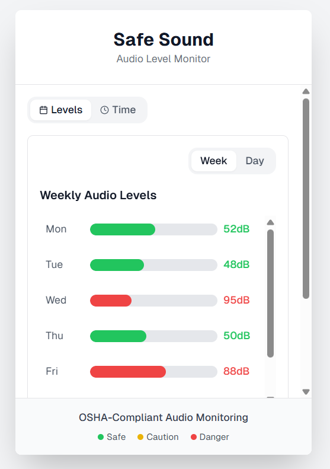

# Safe Sound - System Audio Level Monitor Chrome Extension

A Chrome extension that tracks system audio output levels in decibels and provides OSHA-compliant monitoring with visual graphs and alerts.

## Features

- **Real-time System Audio Monitoring**: Tracks audio output levels from 20-130dB
- **OSHA Compliance**: Color-coded graphs based on OSHA exposure limits
- **Multiple Views**: 
  - Daily view with hourly breakdown
  - Weekly view with daily averages
  - Time-based analysis by decibel ranges
- **Interactive Graphs**: Click on days to drill down to hourly data
- **Backend Integration**: Next.js API with PostgreSQL database
- **Screen Capture Permission**: Uses Chrome's screen capture API to monitor system audio
<h2 align="left">Demo View</h2>
<p align="left"> 
  
</p>

## Tech Stack

- **Frontend**: React, TypeScript, Tailwind CSS
- **Backend**: Next.js 15, PostgreSQL
- **Chrome Extension**: Manifest V2
- **Audio Processing**: Web Audio API with Screen Capture

## Prerequisites

- Node.js 18+ 
- PostgreSQL 12+
- Chrome browser

## Installation

### 1. Clone the repository
```bash
git clone <repository-url>
cd safe-sound-extension
```

### 2. Install dependencies
```bash
npm install
```

### 3. Set up PostgreSQL database

Create a new database:
```sql
CREATE DATABASE safe_sound;
```

### 4. Configure environment variables

Create a `.env.local` file in the root directory:
```env
# Database Configuration
DB_USER=postgres
DB_HOST=localhost
DB_NAME=safe_sound
DB_PASSWORD=your_password
DB_PORT=5432

# Next.js Configuration
NEXT_PUBLIC_API_URL=http://localhost:3000
```

### 5. Initialize the database

Run the database initialization script:
```bash
node scripts/init-db.js
```

### 6. Start the development server
```bash
npm run dev
```

The backend will be available at `http://localhost:3000`

### 7. Load the Chrome extension

1. Open Chrome and go to `chrome://extensions/`
2. Enable "Developer mode" in the top right
3. Click "Load unpacked" and select the project directory
4. The extension should now appear in your extensions list

## Usage

### Chrome Extension

1. **Installation**: The extension will request screen capture permissions on first use
2. **Monitoring**: Click "Start Monitoring" in the popup to begin tracking system audio
3. **Permissions**: Grant screen capture permission when prompted (this captures system audio output)
4. **Viewing Data**: Click the extension icon to open the popup with graphs
5. **Navigation**: 
   - Toggle between "Levels" and "Time" views
   - Switch between "Week" and "Day" views
   - Click on days in weekly view to see hourly breakdown

## Database Schema

The main table `audio_data` stores:
- `id`: Primary key
- `level`: Decibel level (0-130)
- `timestamp`: When measurement was taken
- `hour`: Hour of day (0-23)
- `day`: Day abbreviation (Mon, Tue, etc.)
- `created_at`: Record creation time

## OSHA Guidelines

The extension follows OSHA exposure limits:
- 85-89dB: 8 hours
- 90-94dB: 8 hours  
- 95-99dB: 4 hours
- 100-104dB: 2 hours
- 105-109dB: 1 hour
- 110-114dB: 30 minutes
- 115+dB: 15 minutes